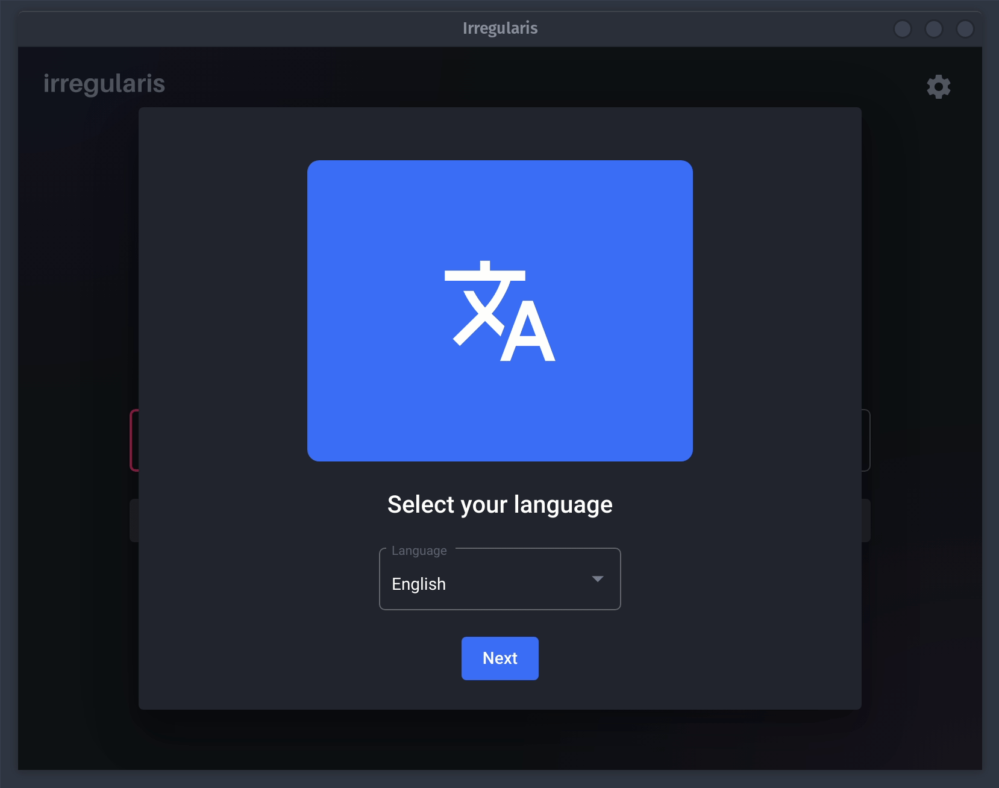
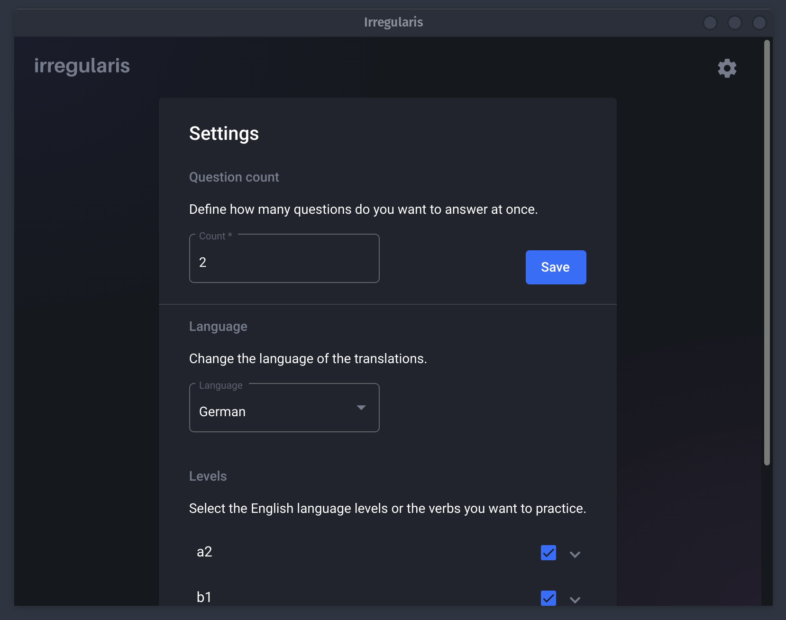
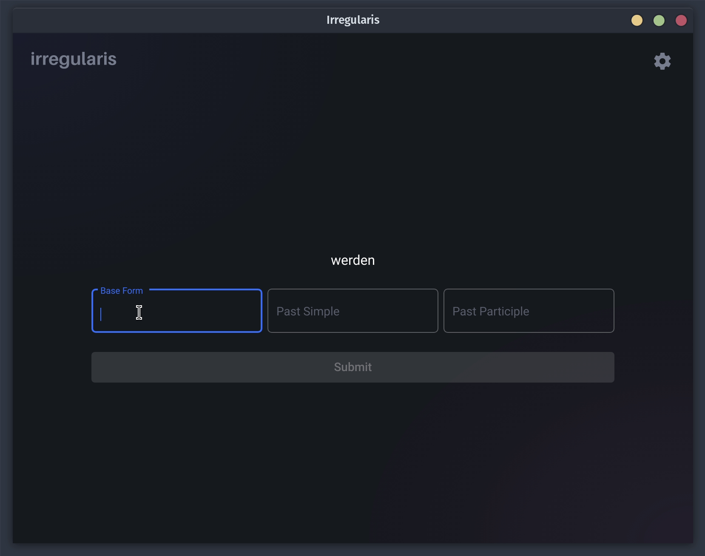

## 

Simple app for practicing the english irregular verbs.

**Supported Platforms**

Windows, Linux and web

To download the app, head to the release [page](https://github.com/gabrielnemeth/irregularis/releases). Hosted version
is available [here](https://irregularis.vercel.app/).

## Usage

On the first run the app will guide you through the initial set-up.



These, as well as further settings can be found under the settings page.



You can practice the irregular verbs on the quiz/home page.



## Build/Run

**Requirements**

- [Node.js](https://nodejs.org) v14.17 or greater
- NPM v6 or greater

**Run the app**

```bash
$ npm install
# Start as a web app:
$ ng serve
# Start as a electron app:
$ npm run start:electron
```

## Contribute

Code contributions are welcome! Please commit any pull requests against the `master` branch.
